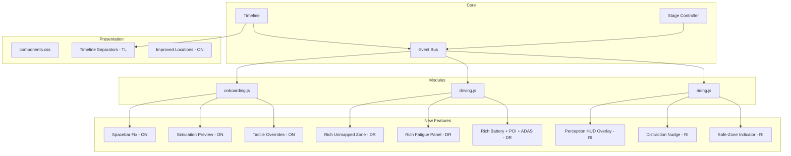

# Design Document: Showcase Rich Features

## Overview

This design covers 12 enhancements to the AeroDrive unified showcase prototype. The changes span bug fixes (spacebar key-repeat), content enrichment (driving/riding tablet panels, locations step, timeline separators), and seven new interactive features (Perception HUD Overlay, Smart Distraction Nudge, Safe-Zone Indicator, Live ADAS Routing, Smart POI Injections, Tactile Overrides, Simulation Mode Preview).

All features are implemented as client-side JavaScript modules rendering into the existing dual-panel (Cluster + Tablet) architecture with CSS animations. No backend or external services are involved.

### Design Decisions

1. **No new steps added to the registry** — All new features enhance existing steps rather than creating new ones, except the Simulation Preview which inserts a transitional view between Preferences and Driving.
2. **Timer cleanup pattern** — Every timed feature (nudge, object cycling, countdown) registers a cleanup via `bus.on('stepWillChange', ...)` to prevent memory leaks.
3. **Progressive enhancement** — New visual features (safe-zone bar, ADAS corridors) are additive overlays that degrade gracefully if CSS animations are disabled.
4. **Existing module boundaries preserved** — Each feature modifies its owning module (`onboarding.js`, `driving.js`, `riding.js`, `timeline.js`) rather than introducing new module files.

---

## Architecture



The architecture remains event-driven. Each feature hooks into the existing `stepDidChange` / `stepWillChange` lifecycle. New visual elements are rendered inside existing `renderTablet` and `renderCluster` functions.

---

## Components and Interfaces

### 1. Spacebar Key-Repeat Fix (Req 1)

**Location:** `showcase/js/modules/onboarding.js` → `renderTakeoverDrillTablet` → `wireGrip()`

**Current behavior:** The existing code already has a `spaceHeld` flag but does not check `event.repeat`. The fix adds an explicit `event.repeat` guard.

**Interface:**
```javascript
// Inside wireGrip()
function onKeyDown(e) {
    if (e.code === 'Space' && e.repeat) { e.preventDefault(); return; }
    if (e.code === 'Space' && stage === 'warning' && !spaceHeld) {
        e.preventDefault();
        spaceHeld = true;
        startGrip();
    }
}
```

**Cleanup:** Reset `spaceHeld = false` on `stepWillChange`.

---

### 2. Rich Driving Tablet Content (Req 2)

**Location:** `showcase/js/modules/driving.js`

#### 2a. Unmapped Zone — Enhanced Map + Countdown

Replace the simple text prompt with:
- SVG map showing a road with a hatched "construction zone" boundary
- Reason label: "Zone not mapped — construction detected"
- Countdown timer (10s) with ring animation
- "Grip wheel" CTA button

#### 2b. Fatigue — Three-Level Escalation Panel

Replace the simple text with a styled escalation card:
- Level 1: Green-tinted card, soft chime icon, "Attention check" text
- Level 2: Amber-tinted card, buzzer icon, "Warning — respond now" text
- Level 3: Red-tinted card, SOS icon, "Critical — SOS in 10s" text
- Transitions animate with `transition: background 500ms, color 500ms`

#### 2c. Battery — Range Math + Interactive Map

Enhance the existing battery tablet:
- Add a "Range Math" summary bar: `Current: 42 km | Charger: 58 km | Deficit: -16 km`
- SVG map already exists; add route corridor coloring (green/yellow/red segments)
- POI pins already exist; enhance with relevance badges and pulsing borders

---

### 3. Rich Riding Tablet Content (Req 3)

**Location:** `showcase/js/modules/riding.js`

Already largely implemented. Enhancements:
- Environment: Add object cycling (4s interval) and count badge updates
- Maneuver: Already has preview card — add countdown timer display
- Productive Time: Already has task list — add "22 min available" header prominently

---

### 4. Timeline Phase Separators (Req 4)

**Location:** `showcase/js/core/timeline.js` + `showcase/css/components.css`

**Approach:** During `render()`, detect stage boundaries and inject separator `<li>` elements between stage groups.

```javascript
// In render(), between nodes of different stages:
<li class="tl-separator" aria-hidden="true">
    <span class="tl-separator-line"></span>
    <span class="tl-separator-label">{nextStageName}</span>
</li>
```

**CSS:** Separators get wider gap (`margin: 0 var(--sp-3)`), a vertical line, and a small label.

**Stage intro cards:** Add brief intro cards at the start of Driving and Riding stages (similar to the existing Intro welcome card).

---

### 5. Improved Locations Step (Req 5)

**Location:** `showcase/js/modules/onboarding.js` → `renderLocationsTablet`

Replace the simple list with:
- SVG map with two location pins (Home 🏠, Work 💼) connected by a route line
- Click/focus on a pin shows a detail card (name, address, route segment, ETA)
- Distance annotations on route segments
- "Add location" button with a `+` icon

---

### 6. Perception HUD Overlay (Req 6)

**Location:** `showcase/js/modules/riding.js` → `renderEnvironmentTablet`

Enhance the existing `buildPerceptionSVG()`:
- **Object cycling:** Every 4s, randomly remove 1-2 objects and add 1-2 new ones, updating the count badge
- **Staggered fade-in:** Each bbox has `animation: fadeIn 300ms ease-out` with `animation-delay` based on index
- **Range sweep:** Already exists — add continuous rotation animation via CSS `@keyframes`
- **Count badge:** Already exists — make it reactive to cycling

---

### 7. Smart Distraction Nudge (Req 7)

**Location:** `showcase/js/modules/riding.js` → `renderProductiveTablet`

**Mechanism:**
- Start an 8-second timer when the step renders
- On fire: inject a nudge banner with amber styling
- Update cluster alert pill from "SERENE" to "ATTENTION"
- Show autonomy budget indicator (progress bar decreasing)
- Cancel timer on `stepWillChange`

```javascript
const nudgeTimer = setTimeout(() => {
    // Inject nudge UI
    // Update cluster pill
}, 8000);
bus.on('stepWillChange', () => clearTimeout(nudgeTimer));
```

---

### 8. Contextual Safe-Zone Indicator (Req 8)

**Location:** `showcase/js/modules/riding.js` — rendered in all riding steps

**Component:** A horizontal gradient bar below the main tablet content:
```html
<div class="safe-zone-bar">
    <div class="sz-segment sz-green" style="flex:2.1"></div>
    <div class="sz-segment sz-yellow" style="flex:0.8"></div>
    <div class="sz-segment sz-red" style="flex:1.2"></div>
    <div class="sz-segment sz-green" style="flex:0.9"></div>
    <div class="sz-marker" style="left:15%"></div>
    <span class="sz-label" style="left:42%">2.1 km</span>
    <span class="sz-label" style="left:58%">3.8 km</span>
</div>
```

The marker position advances slightly on each riding step to simulate movement.

---

### 9. Live ADAS Routing (Req 9)

**Location:** `showcase/js/modules/driving.js` → `renderBatteryTablet`

**Enhancement to existing battery map:**
- Color-code route path segments: green (L4), yellow (L3), red (manual)
- Add a route selection animation: show 3 candidate routes fading in, then highlight the chosen one
- Display "87% autonomous coverage" label after animation
- Update cluster autonomy pill to show current zone type

---

### 10. Smart POI Injections (Req 10)

**Location:** `showcase/js/modules/driving.js` → `renderBatteryTablet`

**Enhancement to existing POI system:**
- Add relevance score badges (HIGH/MED/LOW) to each POI pin
- Fade-in animation (300ms) for POI markers
- Pulsing border on charger POIs when battery < 20%
- Enhanced tooltip with relevance reason
- Visual sorting: highest-relevance POI rendered largest/brightest

---

### 11. Tactile Overrides (Req 11)

**Location:** `showcase/js/modules/onboarding.js` → `renderTakeoverDrillTablet`

**New visual elements during countdown:**
- Steering wheel icon with CSS pulse animation (1Hz → 2Hz at 5s → 3Hz + red glow at 3s)
- Seat vibration indicators (left/right) with shake animation
- Cluster haptic feedback icon synced to pulse
- On grip success: immediately stop all animations, show success state

---

### 12. Simulation Mode Preview (Req 12)

**Location:** `showcase/js/modules/onboarding.js` — new transitional render after Preferences

**Mechanism:** When the user advances from Preferences, instead of immediately going to Driving, render a 5-10s animated preview:
- Top-down car icon performing: accelerate → follow → lane change
- Reflect user preferences (speed, gap, smoothness)
- Progress bar showing remaining time
- "Skip preview" button
- Auto-advance to first Driving step after animation completes
- Cluster shows "SIMULATION" mode label

**Implementation:** Intercept the advance from Preferences, render the preview in the tablet, then call `controller.goTo(drivingFirstIndex)` after completion.

---

## Data Models

### Step Descriptor (existing, unchanged)
```typescript
interface Step {
    id: string;
    globalIndex: number;
    stage: 'intro' | 'onboarding' | 'driving' | 'riding' | 'summary';
    slug: string;
    label: string;
    title: string;
    trustMoments: TrustMoment[];
    timedEvents?: TimedEvent[];
    voice?: boolean;
    notes?: string[];
    renderCluster: (host: HTMLElement, step: Step) => void;
    renderTablet: (host: HTMLElement, step: Step) => void;
}
```

### Safe-Zone Segment (new)
```typescript
interface SafeZoneSegment {
    type: 'green' | 'yellow' | 'red';
    lengthKm: number;
    label?: string;  // e.g., "2.1 km"
}
```

### POI Pin (enhanced)
```typescript
interface POIPin {
    id: string;
    x: number;
    y: number;
    icon: string;
    label: string;
    sub: string;
    recommended: boolean;
    relevance: 'high' | 'medium' | 'low';  // NEW
    relevanceReason?: string;               // NEW
    type: 'charger' | 'food' | 'rest';     // NEW
}
```

### Detected Object (enhanced for cycling)
```typescript
interface DetectedObject {
    type: 'car' | 'pedestrian' | 'sign';
    x: number;
    y: number;
    w: number;
    h: number;
    label: string;
    dist: string;
    delay: number;
    visible: boolean;  // NEW — for cycling in/out
}
```

---

## Error Handling

Since this is a client-side showcase prototype with no network calls or persistent state:

1. **Timer cleanup:** All `setTimeout`/`setInterval` calls are tracked and cleared on `stepWillChange` to prevent orphaned timers.
2. **DOM safety:** All DOM queries use optional chaining or null checks before mutation (e.g., `if (slot) slot.innerHTML = ...`).
3. **Camera/mic failures:** Existing graceful degradation patterns (skip face scan, show text input) are preserved.
4. **Animation fallback:** CSS animations use `prefers-reduced-motion` media query to disable motion for accessibility.
5. **Missing assets:** SVG-based visualizations are inline, so no external asset loading failures are possible.

---

## Testing Strategy

### Why Property-Based Testing Does NOT Apply

This feature set consists entirely of:
- **UI rendering** — DOM manipulation, CSS animations, visual state changes
- **Timer-based interactions** — setTimeout/setInterval with cleanup
- **Event handling** — keyboard/mouse events with state flags
- **Visual feedback** — color changes, animation frequency adjustments

These are all UI rendering and interactive behavior patterns. There are no pure functions with meaningful input variation, no serialization/parsing, no data transformations, and no algorithmic logic that would benefit from property-based testing. The "inputs" are user interactions (clicks, keypresses) and time, not data that varies across a meaningful space.

### Recommended Testing Approach

**Manual/Visual Testing:**
- Each feature should be verified by navigating to the relevant step and observing the visual output
- Timer-based features (nudge, object cycling, escalation) verified by waiting the specified duration
- Keyboard interactions (spacebar fix) verified by holding keys

**Example-Based Unit Tests (if test framework added):**
- Spacebar fix: Verify `event.repeat === true` is ignored
- Timer cleanup: Verify timers are cleared when step changes
- Safe-zone segment rendering: Verify correct number of segments rendered
- POI relevance sorting: Verify highest-relevance POI appears first

**Integration Tests:**
- Full flow: Navigate through all steps and verify no console errors
- Step transitions: Verify cleanup functions fire on step change
- Accessibility: Verify ARIA labels and keyboard navigation work

**Visual Regression (recommended for future):**
- Screenshot comparison of each step's tablet and cluster panels
- Animation state captures at key moments (e.g., fatigue level 3)
