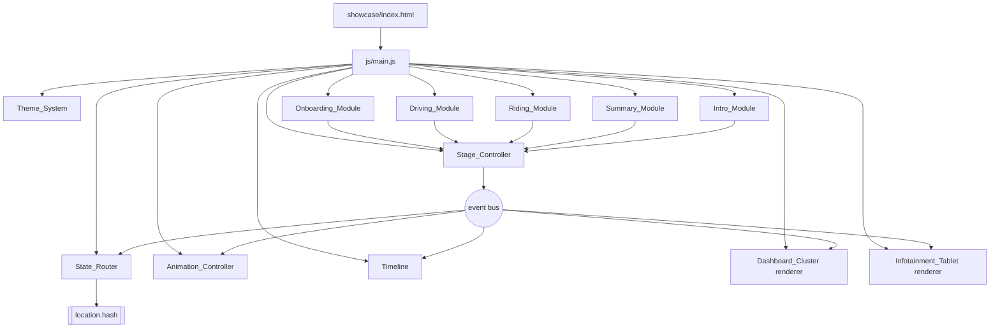
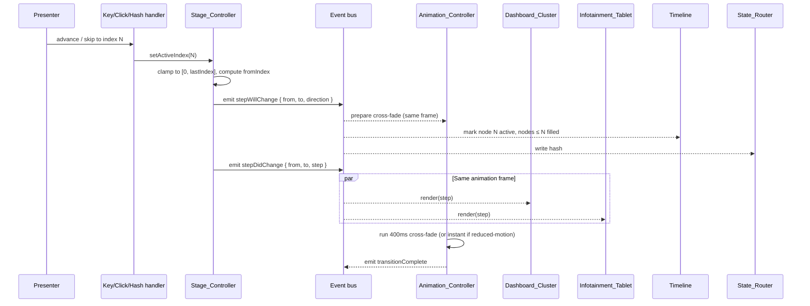
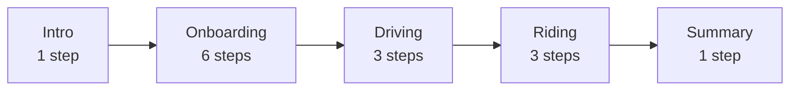

# Design Document

## Overview

The Unified AV Showcase is a single-page, static web prototype that stitches the existing Onboarding and Driving prototypes into one presentation-ready narrative. It runs from `showcase/index.html` with no build step and is designed for a live industry demo: the Presenter must be able to start at the Intro, step linearly through the story, or skip directly to any Step using a persistent Timeline — without ever stranding the demo in a dead-end state.

The design problem decomposes into five concerns that the requirements surface repeatedly:

1. **A single source of truth for "what Step are we on"** that the Dashboard_Cluster and the Infotainment_Tablet always agree on within a single animation frame (Req 5.2, 5.3, 5.4).
2. **A navigation surface that is always reachable** — arrow keys, digit keys, advance/retreat buttons, Timeline nodes, and URL hash — all funnel into the same state transition (Req 4, 12, 13, 15).
3. **A light-mode design system** that feels premium, reads well in a bright demo room, and preserves red/amber for real warnings (Req 6).
4. **Coordinated animations** that cross-fade cluster and tablet in the same frame and degrade to an instant swap under `prefers-reduced-motion` (Req 5.4, 7.1–7.7).
5. **A research-goal frame** that is surfaced on Intro and Summary and tracked as a cumulative Trust_Moment count that is monotonic in the face of backward skips (Req 14).

The aesthetic target is the light-mode vocabulary used by Rivian, Polestar, and Lucid: a warm paper background, high-contrast slate text, a single cobalt accent, soft elevation instead of glassmorphism, and red/amber reserved for warning and critical states only.

### Non-goals

- Persisting state across browser sessions (the URL hash is the only persistence).
- Real voice recognition or real vehicle telemetry — both existing prototypes mock these and the Showcase does the same.
- A responsive mobile layout. The demo runs on a laptop at ≥ 1280 × 800; below that the layout may letterbox.
- Modifying the existing prototypes at the workspace root or at `driving_prototype/` (Req 1.5).

### Research findings informing the design

- **Existing onboarding prototype (`index.html`, `script.js`, `style.css`)**: loads step HTML fragments via `fetch('steps/stepN.html')` into a single `#module-container` and keeps a dashboard cluster in a fixed panel to the side. The Showcase reuses the "fetch + innerHTML" approach for tablet content and keeps a parallel render path for the cluster, but replaces `currentStep` (a single integer in module scope) with a controller object that emits events.
- **Existing driving prototype (`driving_prototype/app.js`)**: already implements three scenarios — `takeover`, `fatigue`, `battery` — plus `touring` and `weather`. The three required Driving Steps map onto the first three. Its scenario definitions (`Scenarios.takeover`, `Scenarios.fatigue`, `Scenarios.battery`) contain the alert-state escalation and the default reroute option the requirements call for and are ported (rewritten to the new renderer interface) into `showcase/js/modules/driving.js`.
- **CSS `cubic-bezier` curves for premium motion**: the Material 3 "emphasized" curve `cubic-bezier(0.2, 0, 0, 1)` reads as confident but soft and matches Polestar/Lucid transitions. A mirrored curve `cubic-bezier(0.3, 0, 0.8, 0.15)` is used for backward navigation so that retreating feels decisive rather than celebratory.
- **WCAG 2.1 contrast**: `#0F172A` on `#F6F5F2` computes to ~16.9:1; `#475569` on `#F6F5F2` computes to ~7.5:1; `#FFFFFF` on `#2B4CFF` computes to ~8.7:1; `#B91C1C` on `#F6F5F2` computes to ~6.8:1. All four pairs clear the 4.5:1 body-text bar in Req 6.3 with margin, which the design exploits to allow slightly smaller caption sizes without dropping below the threshold.
- **`prefers-reduced-motion`**: supported in all target browsers via `window.matchMedia('(prefers-reduced-motion: reduce)')`. The Animation_Controller reads this once at startup and again on change, and short-circuits every transition to an instant swap when set (Req 7.6).
- **Phosphor Icons via CDN** (`https://unpkg.com/@phosphor-icons/web`) is already loaded by both existing prototypes, so continuing to use it keeps the visual family consistent and avoids a new dependency. Lucide was considered but rejected to keep a single icon vocabulary.

## Architecture

The Showcase is a small set of modules that share a single state object through a pub/sub bus. Only the Stage_Controller mutates state; everything else subscribes.

### Module dependency graph



### State flow for a Step change



### Stage sequence



Global Step sequence has 14 Steps (indices 0–13): Intro (0), Onboarding profile/comfort/locations/drive-explanation/takeover-drill/drive-preferences (1–6), Driving takeover/fatigue/battery (7–9), Riding environment/maneuver/productive-time (10–12), Summary (13).

### File and folder layout

```
showcase/
├── index.html                         # Single entry point (Req 1.2)
├── .nojekyll                          # Already at repo root; showcase dir needs nothing extra
├── css/
│   ├── tokens.css                     # :root custom properties (colors, type, spacing, elevation, motion)
│   ├── base.css                       # Reset, typography, body, focus rings
│   ├── layout.css                     # Dual-display grid, timeline placement, intro/summary layouts
│   └── components.css                 # Buttons, cards, alerts, timeline node, cluster frame, tablet frame
├── js/
│   ├── main.js                        # Boot sequence: theme -> router -> controller -> modules -> first render
│   ├── core/
│   │   ├── event-bus.js               # tiny pub/sub (on/off/emit); no deps
│   │   ├── stage-controller.js        # owns activeIndex + countedTrustSteps; exposes advance/retreat/goto
│   │   ├── state-router.js            # encode/decode hash <-> index; hashchange listener
│   │   ├── theme-system.js            # applies token CSS class to <html>; reads prefers-color-scheme (light only in v1)
│   │   ├── animation-controller.js    # orchestrates cross-fade across cluster + tablet in rAF
│   │   ├── timeline.js                # renders nodes, handles click/keyboard, shows trust count
│   │   ├── cluster-host.js            # mounts cluster renderer, manages enter/exit
│   │   └── tablet-host.js             # mounts tablet renderer, manages enter/exit
│   ├── steps/
│   │   └── registry.js                # STEPS array: ordered list of Step descriptors (Data Models §)
│   └── modules/
│       ├── intro.js                   # Intro_Module renderers
│       ├── onboarding.js              # 6 step renderers (cluster + tablet per step)
│       ├── driving.js                 # 3 scenario renderers, ported from driving_prototype
│       ├── riding.js                  # 3 scenario renderers
│       └── summary.js                 # Summary_Module renderer
└── assets/
    ├── bg.png                         # copied from workspace root (Req 1.4)
    ├── car.png                        # copied from workspace root
    ├── seat.png                       # copied from workspace root
    ├── hero-aerodrive.svg             # new placeholder illustration for Intro
    ├── map-route.svg                  # copied/adapted from driving_prototype
    └── icons/                         # optional local fallback if CDN is blocked
```

`.nojekyll` at the repo root already allows GitHub Pages to serve the Showcase. No build step, no bundler, no package.json inside `showcase/`.

## Components and Interfaces

### Event bus

Minimal pub/sub used by every other module. Intentionally tiny and framework-free.

```js
// js/core/event-bus.js
export function createBus() {
  const listeners = new Map(); // type -> Set<fn>
  return {
    on(type, fn)  { if (!listeners.has(type)) listeners.set(type, new Set()); listeners.get(type).add(fn); return () => listeners.get(type).delete(fn); },
    off(type, fn) { listeners.get(type)?.delete(fn); },
    emit(type, payload) { listeners.get(type)?.forEach(fn => fn(payload)); },
  };
}
```

Event vocabulary:

| Event | Payload | Emitted by |
|---|---|---|
| `stepWillChange` | `{ fromIndex, toIndex, direction: 'forward'\|'backward'\|'skip' }` | Stage_Controller |
| `stepDidChange`  | `{ fromIndex, toIndex, step, countedTrustCount }` | Stage_Controller |
| `transitionComplete` | `{ index }` | Animation_Controller |
| `transitionFailed`   | `{ index, reason }` | Animation_Controller |
| `timedEvent`     | `{ stepIndex, eventId, payload }` | per-step timer |
| `reducedMotionChange` | `{ enabled: boolean }` | Animation_Controller |

### Stage_Controller

Single source of truth for `activeIndex` and the `countedTrustSteps` set. Nothing else writes these.

```js
// js/core/stage-controller.js
export function createStageController({ bus, steps, router }) {
  let activeIndex = 0;
  const countedTrustSteps = new Set();     // step indices already counted
  let trustCount = 0;

  function setActive(target, { source = 'api' } = {}) {
    const clamped = Math.max(0, Math.min(steps.length - 1, target | 0));
    if (clamped === activeIndex) return { changed: false, index: activeIndex };

    const fromIndex = activeIndex;
    const direction = clamped === fromIndex + 1 ? 'forward'
                    : clamped === fromIndex - 1 ? 'backward'
                    : 'skip';

    bus.emit('stepWillChange', { fromIndex, toIndex: clamped, direction, source });
    activeIndex = clamped;

    // Trust_Moment accounting: only forward passage through a step can add to count.
    // A backward or same-direction revisit never decrements (Req 14.5).
    for (let i = Math.min(fromIndex, clamped); i <= Math.max(fromIndex, clamped); i++) {
      if (clamped >= i && i <= clamped && !countedTrustSteps.has(i) && direction !== 'backward') {
        // Only count if we are now AT or PAST step i for the first time.
        if (i <= clamped) {
          countedTrustSteps.add(i);
          trustCount += steps[i].trustMoments.length;
        }
      }
    }

    router.write(clamped);
    bus.emit('stepDidChange', { fromIndex, toIndex: clamped, step: steps[clamped], countedTrustCount: trustCount });
    return { changed: true, index: clamped };
  }

  return {
    getActiveIndex: () => activeIndex,
    getTrustCount: () => trustCount,
    getCountedSteps: () => new Set(countedTrustSteps),
    advance: (src)   => setActive(activeIndex + 1, { source: src }),
    retreat: (src)   => setActive(activeIndex - 1, { source: src }),
    goTo:    (i, src)=> setActive(i, { source: src }),
  };
}
```

Key invariants enforced here:

- `activeIndex` is always in `[0, steps.length - 1]` (Req 2.5, 2.7, 12.6).
- `countedTrustSteps` is monotonically non-decreasing in size (Req 14.4, 14.5).
- Every state change goes through exactly one path, `setActive`, regardless of whether the source was a keyboard, a click, the hash, or a programmatic call — this is what makes Req 15.1 (no dead-end) tractable.

### State_Router

Maps between active index and URL hash. Single source for encode/decode.

```js
// js/core/state-router.js
// Hash grammar: '#/' stageSlug '/' stepSlug
// stageSlug in { intro, onboarding, driving, riding, summary }
// stepSlug is Step.slug defined in registry.js

export function createStateRouter({ steps, onIndexFromHash }) {
  function encode(index) {
    const s = steps[index];
    return `#/${s.stage}/${s.slug}`;
  }
  function decode(hash) {
    const m = /^#\/([a-z-]+)\/([a-z0-9-]+)$/.exec(hash || '');
    if (!m) return { ok: false, reason: 'malformed', fragment: hash };
    const [, stage, slug] = m;
    const idx = steps.findIndex(s => s.stage === stage && s.slug === slug);
    if (idx < 0) return { ok: false, reason: 'unknown', fragment: hash };
    return { ok: true, index: idx };
  }
  function write(index) {
    const next = encode(index);
    if (location.hash !== next) history.replaceState(null, '', next);
  }
  window.addEventListener('hashchange', () => {
    const r = decode(location.hash);
    onIndexFromHash(r);
  });
  return { encode, decode, write };
}
```

- `encode(decode(encode(i))) === encode(i)` and `decode(encode(i)).index === i` for every valid `i` (Req 13.5, enforced as a property test).
- `decode` on malformed or unknown input returns `{ ok: false }`; `main.js` then sets index to 0 and renders a non-blocking toast naming the fragment (Req 13.3).
- `write` uses `replaceState` to avoid flooding the history stack during rapid skipping; only the initial load entry and user-triggered hash changes (back/forward) are in history — this satisfies Req 13.4 without making the back button feel laggy.

### Theme_System

Applies the light-mode token class to `<html>` on boot. Tokens live in `css/tokens.css`; the JS module only gates which class is active. The system is intentionally small because v1 is light-mode only.

```js
// js/core/theme-system.js
export function applyTheme() {
  document.documentElement.classList.add('theme-light');
  // If we ever add dark mode, a single class swap is enough; tokens are name-stable.
}
```

### Animation_Controller

Owns the transition timing. Listens for `stepWillChange`, schedules a cross-fade on both hosts inside a single `requestAnimationFrame`, and emits `transitionComplete` when done. On `prefers-reduced-motion: reduce`, it calls the render directly and emits `transitionComplete` the same tick.

```js
// js/core/animation-controller.js
export function createAnimationController({ bus, clusterHost, tabletHost }) {
  const mql = window.matchMedia('(prefers-reduced-motion: reduce)');
  let reduced = mql.matches;
  mql.addEventListener('change', e => { reduced = e.matches; bus.emit('reducedMotionChange', { enabled: reduced }); });
  let current = null; // { index, cancel }

  bus.on('stepDidChange', ({ toIndex, step, fromIndex }) => {
    if (current) current.cancel();              // Req 7.7: cancel in-flight
    if (reduced) {                              // Req 7.6: instantaneous swap
      clusterHost.render(step);
      tabletHost.render(step);
      bus.emit('transitionComplete', { index: toIndex });
      return;
    }
    const direction = toIndex >= fromIndex ? 'forward' : 'backward';
    const duration = Math.abs(toIndex - fromIndex) > 1 ? 600 : 400; // Req 7.4: single animation to skip target
    const easing = direction === 'forward'
      ? 'var(--motion-ease-forward)'
      : 'var(--motion-ease-backward)';
    current = crossFade({ clusterHost, tabletHost, step, duration, easing, onDone: () => {
      bus.emit('transitionComplete', { index: toIndex });
      current = null;
    }, onFail: () => {
      clusterHost.render(step); tabletHost.render(step);
      bus.emit('transitionFailed', { index: toIndex, reason: 'animation-error' });
      bus.emit('transitionComplete', { index: toIndex });
      current = null;
    }});
  });
}

// crossFade schedules a single rAF that flips opacity/translate tokens on both
// hosts in the same frame, satisfying Req 5.2 and 5.4.
function crossFade({ clusterHost, tabletHost, step, duration, easing, onDone, onFail }) {
  let raf = 0;
  let t = null;
  try {
    raf = requestAnimationFrame(() => {
      clusterHost.beginExit(duration, easing);
      tabletHost.beginExit(duration, easing);
      // Both enters scheduled in the next frame keeps them synchronized.
      requestAnimationFrame(() => {
        clusterHost.render(step);
        tabletHost.render(step);
        clusterHost.beginEnter(duration, easing);
        tabletHost.beginEnter(duration, easing);
        t = setTimeout(onDone, duration + 20); // small guard past duration
      });
    });
    return { cancel: () => { cancelAnimationFrame(raf); clearTimeout(t); } };
  } catch (e) { onFail(); return { cancel: () => {} }; }
}
```

Duration contract: `400 ms` for adjacent Step transitions, `600 ms` for skip transitions, and `600 ms` cap for the Stage-entry flourish on the Timeline — every transition is `≤ 600 ms` (Req 7.2). A single forward easing and a single backward easing are used app-wide (Req 7.3).

### Timeline component

Renders one Node per Step in global order, with a horizontal connecting line. Surfaces the cumulative Trust_Moment count to its right. Each Node is a `<button role="listitem" aria-current>` so keyboard users tab through them in order (Req 4.8) and assistive tech reads the Stage + Step label (Req 4.6).

```js
// js/core/timeline.js
export function createTimeline({ bus, steps, controller, host }) {
  function render() {
    const active = controller.getActiveIndex();
    const counted = controller.getCountedSteps();
    host.innerHTML = `
      <ol class="tl" role="list" aria-label="Showcase timeline">
        ${steps.map((s, i) => `
          <li role="listitem">
            <button class="tl-node ${i < active ? 'is-filled' : i === active ? 'is-active' : 'is-unfilled'}"
                    data-index="${i}"
                    aria-current="${i === active ? 'step' : 'false'}"
                    aria-label="${s.stage} — ${s.label}">
              <span class="tl-dot"></span>
              <span class="tl-label">${s.label}</span>
            </button>
          </li>
        `).join('')}
      </ol>
      <div class="tl-trust" aria-live="polite">
        <span class="tl-trust-num">${controller.getTrustCount()}</span>
        <span class="tl-trust-cap">Trust moments</span>
      </div>
    `;
    host.querySelectorAll('.tl-node').forEach(btn => {
      btn.addEventListener('click', () => controller.goTo(+btn.dataset.index, 'timeline'));
      btn.addEventListener('keydown', (e) => {
        if (e.key === 'Enter' || e.key === ' ') { e.preventDefault(); controller.goTo(+btn.dataset.index, 'timeline-kbd'); }
      });
    });
  }
  bus.on('stepDidChange', render);
  bus.on('transitionComplete', render); // keep counter stable even under cancellation
  render();
  return { render };
}
```

Visual states use only token-driven styles:

- `.tl-node.is-unfilled` — `--color-timeline-unfilled` dot on `--color-surface`, border 1px.
- `.tl-node.is-filled` — solid `--color-accent-primary` dot with subtle shadow.
- `.tl-node.is-active` — `--color-accent-primary` dot with a 4px `--color-accent-soft` halo ring and a bolder label.

Filled monotonicity is a single line: `i < activeIndex ? filled : i === activeIndex ? active : unfilled` (Req 4.3, 4.4). The Stage-entry animation (Req 7.5) triggers on `stepDidChange` when `from.stage !== to.stage`: the Timeline adds a 600 ms `is-stage-enter` class that pulses the new Stage's node group with a light accent wash.

### Dashboard_Cluster host and Infotainment_Tablet host

Both hosts expose the same interface so the Animation_Controller does not need to know which is which.

```js
// js/core/cluster-host.js  (same shape for tablet-host.js)
export function createClusterHost({ root }) {
  const canvas = root; // <section class="cluster">
  return {
    render(step) {
      canvas.setAttribute('data-step-id', step.id);
      canvas.innerHTML = '';               // tear down prior content
      step.renderCluster(canvas, step);     // each step owns its own DOM
    },
    beginExit(duration, easing) {
      canvas.style.setProperty('--t', `${duration}ms`);
      canvas.style.setProperty('--e', easing);
      canvas.classList.remove('is-entered'); canvas.classList.add('is-exiting');
    },
    beginEnter(duration, easing) {
      canvas.style.setProperty('--t', `${duration}ms`);
      canvas.style.setProperty('--e', easing);
      canvas.classList.remove('is-exiting'); canvas.classList.add('is-entered');
    },
  };
}
```

Because `render` is called on both hosts in the same rAF tick, `cluster.currentStepId === tablet.currentStepId` holds across every frame the user can observe — this is the invariant that Req 5.3 formalizes.

### Stage modules (Intro_Module, Onboarding_Module, Driving_Module, Riding_Module, Summary_Module)

Each Stage module is a pure renderer that exports a list of Step descriptors. It does not own state; it only reads from `step` and emits user actions by calling `controller.advance()` / `controller.goTo()`.

```js
// js/modules/onboarding.js — shape illustration
export const ONBOARDING_STEPS = [
  {
    id: 'onboarding.profile',
    stage: 'onboarding',
    slug: 'profile',
    label: 'Profile',
    title: 'Say hello, then look up',
    trustMoments: [
      { id: 'face-consent', text: 'Camera only activates during biometric setup' },
    ],
    renderCluster(host, step) { /* status indicator (Req 8.3) */ },
    renderTablet(host, step)  { /* step purpose + primary action (Req 8.2) */ },
  },
  // ... 5 more
];
```

The module's `renderCluster` and `renderTablet` functions accept `(host, step)` and are responsible for wiring any per-Step event listeners. Cleanup is implicit: the host clears `innerHTML` on next render, which tears down listeners attached to removed nodes.

## Data Models

### Step descriptor

Every Step in the registry conforms to this shape. Required fields are non-optional.

```ts
type Stage = 'intro' | 'onboarding' | 'driving' | 'riding' | 'summary';

interface TrustMoment {
  id: string;           // unique across Showcase, e.g. 'onboarding.profile.face-consent'
  text: string;         // <= 90 chars, reads as a single sentence on Summary
}

interface TimedEvent {
  id: string;
  atMs: number;          // offset from step activation
  // The event is emitted on the bus; both cluster and tablet may listen (Req 5.5).
}

interface Step {
  id: string;            // stable, e.g. 'onboarding.comfort'
  globalIndex: number;   // 0..13, assigned by registry.js
  stage: Stage;
  slug: string;          // URL-safe slug inside stage, unique within stage
  label: string;         // short label for Timeline node
  title: string;         // full title for cluster/tablet
  trustMoments: TrustMoment[];    // 0..n; Summary aggregates all of these (Req 11.2, 14.2)
  timedEvents?: TimedEvent[];      // optional, e.g. the 3s maneuver lead in Riding (Req 10.4)
  renderCluster(host: HTMLElement, step: Step): void;
  renderTablet(host: HTMLElement, step: Step): void;
}
```

### Global Step sequence

Defined once in `js/steps/registry.js`:

| Index | Stage | Slug | Label | Source module |
|---:|---|---|---|---|
| 0  | intro       | welcome         | Welcome          | intro.js |
| 1  | onboarding  | profile         | Profile          | onboarding.js |
| 2  | onboarding  | comfort         | Comfort          | onboarding.js |
| 3  | onboarding  | locations       | Locations        | onboarding.js |
| 4  | onboarding  | drive-explained | Drive explained  | onboarding.js |
| 5  | onboarding  | takeover-drill  | Take-over drill  | onboarding.js |
| 6  | onboarding  | preferences     | Preferences      | onboarding.js |
| 7  | driving     | unmapped-zone   | Unmapped zone    | driving.js |
| 8  | driving     | fatigue         | Fatigue watch    | driving.js |
| 9  | driving     | battery         | Battery reroute  | driving.js |
| 10 | riding      | environment     | Environment      | riding.js |
| 11 | riding      | maneuver        | Maneuver         | riding.js |
| 12 | riding      | productive-time | Productive time  | riding.js |
| 13 | summary     | recap           | Recap            | summary.js |

Registry builder asserts uniqueness of `(stage, slug)` and of `id` at boot; this guarantees `decode(encode(i))` is total.

### Application state

The only mutable runtime state:

```ts
interface AppState {
  activeIndex: number;                  // 0..13
  countedTrustSteps: Set<number>;       // indices whose trust moments have been counted
  trustCount: number;                   // derived but cached for fast paint
  reducedMotion: boolean;               // mirrors the media query
  hashError: { fragment: string } | null; // non-null means show toast
}
```

State is held inside the Stage_Controller closure. External modules read it via getters (`getActiveIndex`, `getTrustCount`, `getCountedSteps`). No other module is allowed to hold a writable copy of `activeIndex`.

### Trust_Moment accounting

The controller uses a **set of counted step indices**, not a simple counter, so that the monotonicity invariant is obviously correct:

1. On any Step change, examine every index in `[min(from, to), max(from, to)]`.
2. For each index `i` not yet in `countedTrustSteps`, if the current `activeIndex` is `≥ i` **and** the transition was forward or a forward skip, add `i` to the set and add `step[i].trustMoments.length` to `trustCount`.
3. Backward retreats cannot remove from the set (by construction) and never modify `trustCount` (Req 14.5).

Because membership in `countedTrustSteps` is set-add-only, `trustCount` is monotonically non-decreasing for the lifetime of the session.

### Design tokens (concrete values)

All tokens are declared in `css/tokens.css` on `:root.theme-light`. Names are stable across themes so component CSS never hardcodes a hex.

Colors — light-mode palette with measured WCAG contrast:

| Token | Hex | Role | On pair | Contrast |
|---|---|---|---|---|
| `--color-surface-page`      | `#F6F5F2` | Page background (warm paper) | — | — |
| `--color-surface-elevated`  | `#FFFFFF` | Cluster, Tablet, Timeline surfaces | — | — |
| `--color-surface-subtle`    | `#ECEBE7` | Inset panels, muted cards | — | — |
| `--color-border-subtle`     | `#D8D6D1` | Hairlines, node unfilled ring | — | — |
| `--color-border-strong`     | `#B8B5AD` | Focus ring base | — | — |
| `--color-text-primary`      | `#0F172A` | Body + headings | on `--color-surface-page` | **16.9 : 1** ✓ |
| `--color-text-secondary`    | `#475569` | Captions, meta | on `--color-surface-page` | **7.5 : 1** ✓ |
| `--color-text-on-accent`    | `#FFFFFF` | Text on accent bg | on `--color-accent-primary` | **8.7 : 1** ✓ |
| `--color-accent-primary`    | `#2B4CFF` | Primary CTA, active node, accent line | — | — |
| `--color-accent-soft`       | `#EEF2FF` | Accent wash, halo ring | on primary text | 15.8 : 1 ✓ |
| `--color-success`           | `#1F7A4C` | Completion confirmations | on page | **5.4 : 1** ✓ |
| `--color-warning`           | `#B45309` | Caution (amber-700) | on page | **5.0 : 1** ✓ |
| `--color-critical`          | `#B91C1C` | Takeover, fatigue escalate, critical alert | on page | **6.8 : 1** ✓ |
| `--color-focus-ring`        | `#2B4CFF` | Keyboard focus outline | on page | 8.0 : 1 ✓ |

Body text (16 px) uses `--color-text-primary` on `--color-surface-page` or `--color-surface-elevated` and clears the 4.5 : 1 bar with 16+:1 margin. Captions (12 px) on `--color-text-secondary` clear 4.5 : 1 at 7.5 : 1. Large CTA text (18 px semibold) on `--color-accent-primary` clears 3.0 : 1 at 8.7 : 1. Red, amber, and green foregrounds all clear the body-text bar, which keeps color-coded status text readable without needing a background tint behind it.

Typography scale:

| Token | Size / line-height | Weight | Use |
|---|---|---|---|
| `--font-display`  | `clamp(40px, 5vw, 56px) / 1.08` | 300 | Intro headline, Summary headline |
| `--font-heading`  | `28px / 1.2`                     | 500 | Step title on Tablet |
| `--font-subhead`  | `20px / 1.3`                     | 500 | Cluster status label |
| `--font-body`     | `16px / 1.55`                    | 400 | Paragraphs, list items |
| `--font-caption`  | `12px / 1.4, letter-spacing .06em, uppercase` | 600 | Timeline labels, meta tags |
| `--font-mono`     | `13px / 1.4`                     | 500 | Speed/% readouts on Cluster |

Font family is `Inter`, loaded the same way as the existing prototypes.

Spacing scale, single ramp:

```
--sp-1: 4px;  --sp-2: 8px;  --sp-3: 12px; --sp-4: 16px;
--sp-5: 24px; --sp-6: 32px; --sp-7: 48px; --sp-8: 64px;
```

Elevation — soft, layered shadows tuned for light mode (no heavy drop shadows, no glassmorphism):

```
--elevation-0: none;
--elevation-1: 0 1px 2px rgba(15, 23, 42, .04), 0 1px 1px rgba(15, 23, 42, .03);
--elevation-2: 0 4px 12px rgba(15, 23, 42, .06), 0 1px 2px rgba(15, 23, 42, .04);
--elevation-3: 0 12px 32px rgba(15, 23, 42, .08), 0 2px 6px rgba(15, 23, 42, .04);
```

Cluster surface uses `--elevation-2`, Tablet surface uses `--elevation-2`, Timeline uses `--elevation-1`, modal alerts use `--elevation-3`.

Motion tokens:

```
--motion-dur-micro:  200ms;  /* button press, tooltip */
--motion-dur-step:   400ms;  /* step-to-step cross-fade */
--motion-dur-stage:  600ms;  /* skip transitions, stage-entry flourish */
--motion-ease-forward:  cubic-bezier(0.2, 0, 0, 1);     /* confident outgoing */
--motion-ease-backward: cubic-bezier(0.3, 0, 0.8, 0.15); /* decisive incoming */
--motion-ease-subtle:   cubic-bezier(0.4, 0, 0.2, 1);   /* interactive */
```

Under `prefers-reduced-motion: reduce`, `tokens.css` overrides all three durations to `0ms` via a media query, which makes every CSS-driven transition instant without touching component code.

### Dual-display layout

CSS grid on the root `.stage`:

```
.stage {
  display: grid;
  grid-template-columns: minmax(420px, 5fr) minmax(520px, 7fr);
  grid-template-rows: 1fr auto;
  grid-template-areas:
    "cluster tablet"
    "timeline timeline";
  gap: var(--sp-5);
  padding: var(--sp-5);
  background: var(--color-surface-page);
  min-height: 100vh;
}
.cluster  { grid-area: cluster; }
.tablet   { grid-area: tablet; }
.timeline { grid-area: timeline; }
```

Framing: both surfaces share the same rounded-corner radius (`14px`), the same elevation token (`--elevation-2`), and a 1 px top edge highlight (`inset 0 1px 0 rgba(255,255,255,.6)`) that reads as a single pane of laminated glass. A 2 px continuous accent underline running from the right edge of the Cluster to the left edge of the Tablet reinforces the "one vehicle" read. Below 1100 px viewport width the grid stacks (`grid-template-columns: 1fr; grid-template-areas: "cluster" "tablet" "timeline";`), which lets the Showcase degrade gracefully on narrow presenter monitors without losing the pairing.

### Stage-specific designs

**Intro_Screen (index 0).** Full-bleed light background with `hero-aerodrive.svg` occupying the left 55 %. Hero is an SVG illustration of the AeroDrive three-quarter view. When the file is missing, the `` `onerror` handler swaps in a styled placeholder block of the same `aspect-ratio: 16 / 10` with visible alt text (Req 3.4). Right column holds: `H1 --font-display` naming the AeroDrive and the delivery moment (Req 3.1); sub-heading `--font-subhead` in `--color-text-secondary` stating the research goal verbatim (Req 3.2, 14.1); one primary CTA button "Begin onboarding" wired to `controller.advance()` (Req 3.5, 3.6). The Timeline sits below at `grid-area: timeline`.

**Onboarding Steps 1–6 (indices 1–6).** Cluster shows a status indicator: large step title, a 6-segment progress pip strip, and a contextual readout ("PROFILE: CAPTURING" / "CABIN: CALIBRATING" etc.) in `--font-caption`, reusing the semantics of `hudContextMap` from the existing `script.js`. Tablet shows the Step title, one-sentence purpose, and the primary control (Req 8.2): mic-ring for Profile, interactive seat diagram for Comfort, slider group for Locations, 4-slide carousel for Drive-explanation, countdown + "Grip wheel" button for Take-over drill, preference cards for Preferences. When the primary action completes, the Tablet renders an inline `is-complete` pill with a checkmark before emitting `controller.advance()` after a 350 ms acknowledgement beat (Req 8.5). For the take-over drill (Step 5), both Cluster and Tablet run a synchronized 10-second countdown driven by a single `setInterval(…, 1000)` whose ticks are published through the event bus as `timedEvent` (Req 8.4, 5.5). Every Onboarding step declares at least one `trustMoment` — e.g. "Camera only activates during biometric setup" on Profile, "Your seat profile is stored locally" on Comfort — surfaced inline with a small shield icon (Req 8.7).

**Driving Steps 7–9 (indices 7–9).** Cluster shows speed (`--font-mono`), autonomy level ("L4 ACTIVE"), and an alert state pill whose background color is one of `--color-success` / `--color-warning` / `--color-critical` (Req 9.3). Tablet shows the scenario title and the autonomous system's intent as a single sentence (Req 9.2). Scenario-specific behaviors:
  - *Unmapped zone (7)*: after 2 s of scenario time, Cluster and Tablet simultaneously render a takeover prompt — Cluster shows a pulsing `--color-critical` banner "TAKE OVER NOW", Tablet shows the reason ("AeroDrive has detected an unmapped zone") and a large "Grip wheel" primary button (Req 9.4).
  - *Fatigue (8)*: three escalation levels cycle every 4 s. Level 1 renders Cluster alert pill in `--color-warning` with copy "ATTENTION CHECK", Level 2 in a stronger warning with a subtle edge pulse, Level 3 in `--color-critical` with a jarring edge pulse. Each level uses a visibly distinct alert state (Req 9.5).
  - *Battery (9)*: Tablet renders two choice cards, "Reroute to nearest charger (recommended)" and "Continue on planned route". The "Reroute" card is marked as default with a `--color-accent-primary` outline and is auto-focused on step entry (Req 9.6).

Trust_Moments on Driving: "AeroDrive asks, it doesn't take", "System watches you watching the road", "Range math is shown, not hidden" (Req 9.7).

**Riding Steps 10–12 (indices 10–12).** Cluster renders a "PASSENGER MODE" pill at all three Steps (Req 10.2), speed readout continues, and the alert state is muted. Tablet:
  - *Environment (10)*: ambient status card — weather, cabin temp, air quality dots, ambient light setting — as a 2×2 grid (Req 10.3).
  - *Maneuver (11)*: a maneuver preview card ("Left turn in 3 s → Oak St") is rendered on the Tablet at `atMs: 0`. A `timedEvent` at `atMs: 3000` flashes a maneuver banner on the Cluster. Because Tablet renders the preview before the Cluster fires, the 3 s lead (Req 10.4) is driven by a single timer that the registry declares, not by ad-hoc setTimeouts.
  - *Productive time (12)*: an in-ride activity surface — a small email/calendar/reading-list mock — labeled "Productive time" (Req 10.5).

Trust_Moments on Riding: "You see the turn before the car makes it", "Passenger mode shows, not just says, handover", "Your time is yours back".

**Summary (index 13).** Single Step. Cluster shows a "COMPLETE" pill in `--color-success` and the Timeline displays the full filled row. Tablet shows: the research goal statement restated as a headline (Req 11.3, 14.1), then a scrolling list of every `TrustMoment` declared by every module, grouped by Stage, with the shield icon (Req 11.2). A primary CTA "Restart showcase" calls `controller.goTo(0)` (Req 11.4). An end-of-showcase indicator replaces the normal advance control on this Step (Req 12.6).

## Correctness Properties

*A property is a characteristic or behavior that should hold true across all valid executions of a system — essentially, a formal statement about what the system should do. Properties serve as the bridge between human-readable specifications and machine-verifiable correctness guarantees.*

The Showcase is PBT-appropriate: the Stage_Controller, registry, State_Router, and Timeline are pure logic with clear inputs and outputs; the rendering and hash layers have universal invariants across the entire Step space. Scenario-specific UI content (which exact card or illustration appears on a given Step) is covered by example-based tests in the Testing Strategy section.

### Property 1: Dual-display step equality

*For any* sequence of controller actions (advance, retreat, goTo, keyboard, timeline click, hashchange), after the `stepDidChange` event for the sequence's final action is observed, `clusterHost.currentStepId === tabletHost.currentStepId` and both equal `steps[controller.getActiveIndex()].id`.

**Validates: Requirements 2.3, 5.3**

### Property 2: Registry index bijection

*For any* non-empty list of Step descriptor inputs, the registry builder produces a list whose `globalIndex` values form the bijection `0..n-1` to the input, preserving input order.

**Validates: Requirements 2.2**

### Property 3: Navigation boundary no-op

*For any* navigation action source `src ∈ {arrow-key, button, timeline, api}`, calling `advance(src)` when `activeIndex === lastIndex` leaves `activeIndex` unchanged, and calling `retreat(src)` when `activeIndex === 0` leaves `activeIndex` unchanged; the returned `changed` flag is `false`; and on the final step `advance` additionally causes the end-of-showcase indicator element to be present in the DOM.

**Validates: Requirements 2.5, 2.7, 12.6**

### Property 4: Navigation clamp and step semantics

*For any* `activeIndex i` and source `src`, the result of `advance(src)` equals `min(i + 1, lastIndex)` and the result of `retreat(src)` equals `max(i - 1, 0)`, regardless of source.

**Validates: Requirements 2.4, 2.6, 12.1, 12.2**

### Property 5: Timeline visual state monotonicity

*For any* `activeIndex N` and every node index `i ∈ [0, lastIndex]`, exactly one of the classes `is-filled`, `is-active`, `is-unfilled` is set, and: `i < N ⇒ is-filled`, `i === N ⇒ is-active`, `i > N ⇒ is-unfilled`.

**Validates: Requirements 4.3, 4.4**

### Property 6: Timeline node count equals step count

*For any* STEPS registry of length `n`, the Timeline contains exactly `n` node elements reachable via the role hierarchy `list > listitem > button.tl-node`.

**Validates: Requirements 4.1**

### Property 7: Timeline accessible name completeness

*For any* `step` in the STEPS registry, the corresponding Timeline node's accessible name (computed via ARIA from `aria-label`) contains both `step.stage` and `step.label` as substrings.

**Validates: Requirements 4.6**

### Property 8: Timeline tab order matches registry order

*For any* STEPS registry, the sequence of `.tl-node` buttons in DOM order equals the sequence of `steps[i]` by `globalIndex`, and each button has `tabindex >= 0`.

**Validates: Requirements 4.8**

### Property 9: Node activation by click or keyboard

*For any* starting `activeIndex i`, target node index `j ∈ [0, lastIndex]`, and activation method `m ∈ {click, Enter, Space}`, invoking method `m` on node `j` results in `controller.getActiveIndex() === j`.

**Validates: Requirements 4.5, 4.7**

### Property 10: Dual-host render in same animation frame

*For any* Step change caused by a controller action, within the first `requestAnimationFrame` callback following the `stepDidChange` emission, both `clusterHost.canvas.getAttribute('data-step-id')` and `tabletHost.canvas.getAttribute('data-step-id')` equal the new `step.id`.

**Validates: Requirements 5.2, 5.4**

### Property 11: Shared timed-event cross-host synchronization

*For any* `timedEvent` emitted on the event bus during an active Step, the timestamps at which the Dashboard_Cluster listener and the Infotainment_Tablet listener record delivery differ by at most 100 milliseconds.

**Validates: Requirements 5.5**

### Property 12: Contrast ratio compliance

*For any* `(fg, bg)` color token pair declared as a body-text pair in the tokens manifest, the WCAG 2.1 relative-luminance contrast ratio `contrast(fg, bg) ≥ 4.5`. *For any* `(fg, bg)` pair declared as a large-text or CTA pair, `contrast(fg, bg) ≥ 3.0`.

**Validates: Requirements 6.3, 6.4**

### Property 13: Transition duration bound

*For any* Step change, the wall-clock interval from `stepWillChange` emission to the corresponding `transitionComplete` emission is `≤ 600 ms` when `prefers-reduced-motion` is not set.

**Validates: Requirements 7.2**

### Property 14: Skip transition is a single animation

*For any* Step change where `|toIndex − fromIndex| > 1`, the number of `crossFade` invocations between that `stepWillChange` and its `transitionComplete` is exactly 1.

**Validates: Requirements 7.4**

### Property 15: Stage-entry animation on stage crossings

*For any* Step change where `steps[fromIndex].stage !== steps[toIndex].stage`, the Timeline receives the `is-stage-enter` class within the rAF frame after `stepDidChange` and the class is removed after `600 ms`.

**Validates: Requirements 7.5**

### Property 16: Reduced-motion instant swap

*For any* Step change when `window.matchMedia('(prefers-reduced-motion: reduce)').matches === true`, the wall-clock interval from `stepWillChange` to `transitionComplete` is `0 ms` (same tick) and no CSS transition is initiated on either host.

**Validates: Requirements 7.6**

### Property 17: In-flight animation cancellation

*For any* two Step change requests `g1` then `g2` issued within one `--motion-dur-stage` window, after both transitions settle, both hosts' `data-step-id` equals `steps[g2.toIndex].id`.

**Validates: Requirements 7.7**

### Property 18: Onboarding step render shape

*For any* step `s` where `s.stage === 'onboarding'`, after `renderCluster(s)` and `renderTablet(s)`: the Tablet subtree contains exactly one heading element matching `s.title`, one paragraph describing the Step purpose, and at least one `role="button"` primary control; and the Cluster subtree contains a status-indicator element whose text includes `s.label`.

**Validates: Requirements 8.2, 8.3**

### Property 19: Voice steps also accept on-screen control

*For any* step `s` where `s.stage === 'onboarding' && s.voice === true`, the rendered Tablet subtree contains at least one `role="button"` control whose activation invokes `controller.advance()`.

**Validates: Requirements 8.6**

### Property 20: Trust-moment minimum per non-boundary step

*For any* step `s` with `s.stage ∈ {onboarding, driving, riding}`, `s.trustMoments.length ≥ 1`.

**Validates: Requirements 8.7, 9.7, 10.6**

### Property 21: Driving step render shape

*For any* step `s` where `s.stage === 'driving'`, after `renderCluster(s)` and `renderTablet(s)`: the Tablet subtree contains a title matching `s.title` and a distinct element describing autonomous-system intent; the Cluster subtree contains a speed readout element, an autonomy-level tag, and an alert-state pill.

**Validates: Requirements 9.2, 9.3**

### Property 22: Fatigue escalation levels are distinct

*For any* two distinct fatigue escalation levels `a, b ∈ {1, 2, 3}`, the class list of the rendered Cluster alert pill at level `a` differs from its class list at level `b` by at least one class.

**Validates: Requirements 9.5**

### Property 23: Riding passenger-mode indicator

*For any* step `s` where `s.stage === 'riding'`, after `renderCluster(s)` the Cluster subtree contains an element with class `cluster-passenger-pill` whose text matches `/passenger/i`.

**Validates: Requirements 10.2**

### Property 24: Maneuver preview lead time

*For any* riding maneuver Step `s` with a declared maneuver event, the Tablet preview element's appearance timestamp `tPreview` and the Cluster maneuver banner's appearance timestamp `tEvent` satisfy `tEvent − tPreview ≥ 3000 ms`.

**Validates: Requirements 10.4**

### Property 25: Summary includes every trust moment

*For any* `TrustMoment tm` declared by any step in the STEPS registry, after `renderTablet(summaryStep)` the Summary Tablet subtree contains an element whose text equals `tm.text`.

**Validates: Requirements 11.2**

### Property 26: Digit-key stage jump

*For any* digit `d ∈ {1..5}` dispatched as a keyboard event, `controller.getActiveIndex()` after the dispatch equals the `globalIndex` of the first step whose stage is the `d`-th stage in the canonical Stage list `[intro, onboarding, driving, riding, summary]`.

**Validates: Requirements 12.3**

### Property 27: Advance/retreat control presence

*For any* step `s` with `s.globalIndex < lastIndex`, the rendered page contains a visible advance control; *for any* step `s` with `s.globalIndex > 0`, the rendered page contains a visible retreat control.

**Validates: Requirements 12.4, 12.5**

### Property 28: Hash round-trip

*For any* valid `globalIndex i ∈ [0, lastIndex]`, `decode(encode(i)).ok === true` and `decode(encode(i)).index === i`; *for any* string `s` such that `decode(s).ok === true`, `encode(decode(s).index) === s`.

**Validates: Requirements 13.5**

### Property 29: Trust-count correctness and monotonicity

*For any* finite sequence of controller actions that produces a sequence of active indices `i0, i1, ..., ik`, let `S = { j : ∃m. im === j ∧ im was reached via forward or forward-skip }`. Then after the last action, `controller.getTrustCount() === Σ_{j ∈ S} steps[j].trustMoments.length`, and the sequence `t0, t1, ..., tk` of trust counts is monotonically non-decreasing.

**Validates: Requirements 14.4, 14.5**

### Property 30: Reachability via advance and retreat only

*For any* pair `(A, B)` of `globalIndex` values in `[0, lastIndex]`, there exists a finite sequence of `advance` and `retreat` calls starting from `activeIndex === A` that terminates with `activeIndex === B`.

**Validates: Requirements 15.1**

### Property 31: Transition failure recovery

*For any* Step change during which the `crossFade` helper throws, after the error both `clusterHost.canvas.getAttribute('data-step-id')` and `tabletHost.canvas.getAttribute('data-step-id')` equal the target `step.id` and a `transitionComplete` event is emitted on the bus with the target index.

**Validates: Requirements 15.3**

### Property 32: Per-step render budget

*For any* Step change on a mocked timing harness configured to simulate a typical laptop, the wall-clock interval from `controller.setActive()` call to both hosts' `data-step-id` equaling the new step is `≤ 200 ms`.

**Validates: Requirements 16.2**

## Error Handling

The Showcase is mostly client-side rendering with tightly controlled inputs. Errors fall into four categories, each with a defined recovery path.

**Invalid or unknown URL hash (Req 13.3).** `State_Router.decode` returns `{ ok: false, reason, fragment }`. On boot, `main.js` calls `controller.goTo(0)` and sets `hashError = { fragment }`. A non-blocking toast rendered above the Timeline displays "Unknown deep link: `#/bogus`" with a dismiss button. The hash is rewritten to `encode(0)` so future reloads are clean.

**Missing asset — hero illustration (Req 3.4).** The Intro `` has an `onerror` handler that adds `hero--missing` class and swaps the image for a styled placeholder block of the same aspect ratio. Alt text is always present, and the placeholder visually says "AeroDrive hero illustration" in `--font-caption`. The test harness asserts that disabling the asset causes the placeholder branch.

**Missing step fragment or registry drift.** If the registry contains a step with duplicate `(stage, slug)` or a `renderCluster`/`renderTablet` that throws, `main.js` catches the error, logs `[showcase] render error for step ${step.id}`, and renders a minimal "Step failed to render" card on both hosts while still emitting `transitionComplete` so navigation stays unblocked.

**Animation failure (Req 15.3).** If `requestAnimationFrame` throws or a CSS transition never settles (detected via the post-duration setTimeout guard), the Animation_Controller's `onFail` path synchronously renders the target step on both hosts and emits `transitionComplete` with `reason: 'animation-error'`. Navigation never strands.

**Voice recognition unavailable.** For onboarding steps that reference voice, the Showcase reads `'webkitSpeechRecognition' in window`. If false, the on-screen control (Req 8.6) is the sole interaction path and the voice hint is hidden. This is the same graceful-degradation pattern used in the existing prototype.

**Reduced-motion activated mid-session.** The Animation_Controller's `matchMedia` change listener updates `reduced` and emits `reducedMotionChange`. Any in-flight transition is canceled; subsequent transitions are instant.

**Hash change during an in-flight transition.** Handled by Property 17: the in-flight animation is canceled and the new target is rendered. No special error path is needed.

## Testing Strategy

The Showcase is a mix of pure controller logic, pure registry logic, and scenario rendering. The strategy is **property-based tests for the universal invariants** and **example-based unit tests for scenario-specific content**.

### Library choice

`fast-check` for property-based testing (JavaScript, MIT, actively maintained) and `vitest` as the test runner. Both run in Node with a `jsdom` environment. Reason: the Showcase is vanilla JS; adding `fast-check` + `vitest` is a `devDependencies`-only change and does not affect the zero-build runtime of the Showcase itself. A single `showcase/package.json` is permitted for dev tooling because Req 1.3 only forbids a build step at runtime — not a test-time dev dependency — and the Showcase still loads with no build step when `showcase/index.html` is opened directly.

### Test layout

```
showcase/
├── package.json              # devDependencies only; no build, no bundle
└── tests/
    ├── properties/
    │   ├── controller.test.js      # P1, P3, P4, P29, P30
    │   ├── registry.test.js        # P2, P20
    │   ├── timeline.test.js        # P5, P6, P7, P8, P9
    │   ├── dual-display.test.js    # P10, P11, P17
    │   ├── animation.test.js       # P13, P14, P15, P16, P31, P32
    │   ├── router.test.js          # P28
    │   ├── contrast.test.js        # P12
    │   ├── rendering.test.js       # P18, P21, P23, P27
    │   ├── scenarios.test.js       # P22, P24, P25
    │   ├── keyboard.test.js        # P26, P9 (keyboard half)
    │   └── voice.test.js           # P19
    └── examples/
        ├── intro.test.js           # 3.1, 3.2, 3.3, 3.4, 3.5, 3.6
        ├── onboarding.test.js      # 8.1, 8.4, 8.5
        ├── driving.test.js         # 9.1, 9.4, 9.6
        ├── riding.test.js          # 10.1, 10.3, 10.5
        ├── summary.test.js         # 11.1, 11.3, 11.4
        └── hash.test.js            # 13.3 (error toast)
```

### Property-test configuration

- Every `fc.assert` call uses `{ numRuns: 100 }` minimum (≥ 100 iterations per property, per the testing requirement).
- Every property test is tagged in a comment with the design property it implements, using the mandated format: `// Feature: unified-av-showcase, Property {n}: {property title}`.
- Each Correctness Property in this document maps to **exactly one** property-based test file entry in `showcase/tests/properties/`. The mapping is the bracketed list above.
- `fast-check` arbitraries used:
  - `fc.integer({ min: 0, max: lastIndex })` for active indices.
  - `fc.array(fc.constantFrom('advance','retreat','goTo','timelineClick','keyEnter','keySpace','keyArrowRight','keyArrowLeft','keyDigit'))` for action sequences (length up to 30).
  - `fc.tuple(fc.integer, fc.integer)` for from/to pairs in skip tests.
  - A custom arbitrary for action sequences plus matching target indices.

### Example-based tests

Scenario content (the specific text of "AeroDrive has detected an unmapped zone", the exact two reroute choices, the three specific maneuver events, the research-goal sentence) is verified by example-based tests. These are fast, small, and have one representative assertion per acceptance criterion listed in the `tests/examples/` map above.

### Smoke and integration tests

Requirements classified as SMOKE (1.1–1.5, 6.1, 6.5, 6.6, 6.7, 7.3, 16.1) become single-run tests:

- `tests/smoke/structure.test.js` — directory tree, no external refs, no build script.
- `tests/smoke/tokens.test.js` — parses `css/tokens.css` and asserts the required token names exist and component CSS never writes raw hex, px-spacing, or cubic-bezier literals.
- `tests/smoke/boot.test.js` — after boot, `<html>` has class `theme-light`.
- `tests/smoke/perf-startup.test.js` — measures Intro render time in a `jsdom` harness; fails if > 2 s (Req 16.1).
- `tests/smoke/fps.test.js` — classified INTEGRATION (Req 16.3): runs a scripted advance-through-all-steps pass and samples `performance.now()` deltas; not a property test, one representative run, asserts mean frame interval `≤ 20 ms`.

### Unit-test balance

Following the design-guidance, example-based tests stay limited to scenario-specific content and edge cases (missing hero, malformed hash, failed animation). Universal behavior — everything that should hold "for all inputs" — is covered by the 32 properties listed above. This gives comprehensive coverage without test-count bloat.

## Assets Plan

Copied from existing prototypes into `showcase/assets/` (Req 1.4 — no `../` references from showcase back to root):

- `bg.png` — copied from workspace root, used as subtle page background if needed.
- `car.png` — copied from workspace root, available for Onboarding comfort step.
- `seat.png` — copied from workspace root, used in Onboarding comfort step's interactive seat diagram.
- `map-route.svg` — extracted from `driving_prototype/styles.css`'s inline SVG layers (Scenario 5 weather map) and saved as a standalone SVG; used in Driving battery-reroute step.

New assets created for the Showcase:

- `hero-aerodrive.svg` — a light-mode line illustration of the AeroDrive three-quarter view, placed on Intro. If the file is missing at load, the placeholder fallback (Req 3.4) handles it gracefully.
- `icons/` — optional local fallback copies of the small set of Phosphor icons used (check, warning-circle, steering-wheel, battery-warning, cloud-rain, eye-closed, compass, arrow-right). The runtime default is the Phosphor CDN (`https://unpkg.com/@phosphor-icons/web`) used by both existing prototypes, which keeps the visual family consistent. The local `icons/` copies exist so the Showcase remains functional offline.

No new font files; Inter is loaded from Google Fonts as in the existing prototypes.

## Accessibility and Reduced Motion

- **Focus rings.** Every interactive element (`button`, `a`, `input`, `.tl-node`) carries a `:focus-visible` outline of `3px solid var(--color-focus-ring)` with a `2px` offset, on top of the surface token — never "removed via `outline: none`".
- **ARIA on Timeline.** Each node is `<button aria-label>` with `aria-current="step"` on the active node. The Timeline container is `role="list"`. The cumulative Trust_Moment counter is `aria-live="polite"` so assistive tech announces the increase when the count grows (Req 14.3).
- **Screen-reader step announcements.** A visually hidden `<div role="status" aria-live="polite">` in `main.js` is updated with `"{stage}, step {stepNumber} of {total}: {label}"` on every `stepDidChange`.
- **Keyboard navigation.** Tab order is: skip link → page header → Cluster interactive elements → Tablet interactive elements → Timeline nodes → advance/retreat controls. Arrow keys are globally bound (Req 12.1, 12.2, 12.3) but only when focus is not inside a text input.
- **Reduced motion.** `tokens.css` contains:

  ```css
  @media (prefers-reduced-motion: reduce) {
    :root {
      --motion-dur-micro: 0ms;
      --motion-dur-step:  0ms;
      --motion-dur-stage: 0ms;
    }
    * { animation-duration: 0s !important; transition-duration: 0s !important; }
  }
  ```

  The Animation_Controller also short-circuits programmatically, so both the CSS and JS paths agree.

## Design Decision Log

- **Single source of truth at the controller, not per-module state.** Splitting `activeIndex` across modules (as the existing prototype does with `currentStep` in `script.js`) would make Req 15.1 (no dead-end) and Req 5.3 (dual-display equality) much harder to guarantee. Centralizing it is the single most important architectural decision.
- **Set-based Trust_Moment accounting instead of a running counter.** Using a `Set<number>` of counted step indices makes Req 14.5 (monotonicity on backward skip) self-evidently correct — the set can only grow. A simple counter would require careful bookkeeping to prevent double-counting on repeat forward passes.
- **Phosphor Icons via CDN, not an icon sprite.** Both existing prototypes already load Phosphor from `unpkg.com`; using the same CDN keeps the icon visual family identical and avoids shipping a new sprite.
- **`fast-check` + `vitest` as dev-only deps.** Req 1.3 bars a runtime build step but does not forbid a dev-only test harness. Without a property-based test library, Properties 1–32 would have to be written by hand and would lose shrinking and counterexample generation. Adding it to `devDependencies` inside `showcase/package.json` preserves the "no build step at runtime" contract.
- **600 ms cap for skip transitions, 400 ms for adjacent.** Req 7.2 allows up to 600 ms. Using the full budget only for skip (where the visual distance is larger) keeps the default feel snappy.
- **Light-mode only for v1.** Tokens are named neutrally (`--color-surface-page`, not `--color-white`) so a future dark-mode class adds a sibling token block without renaming anything. This is a forward-compatibility decision, not a v1 deliverable.

